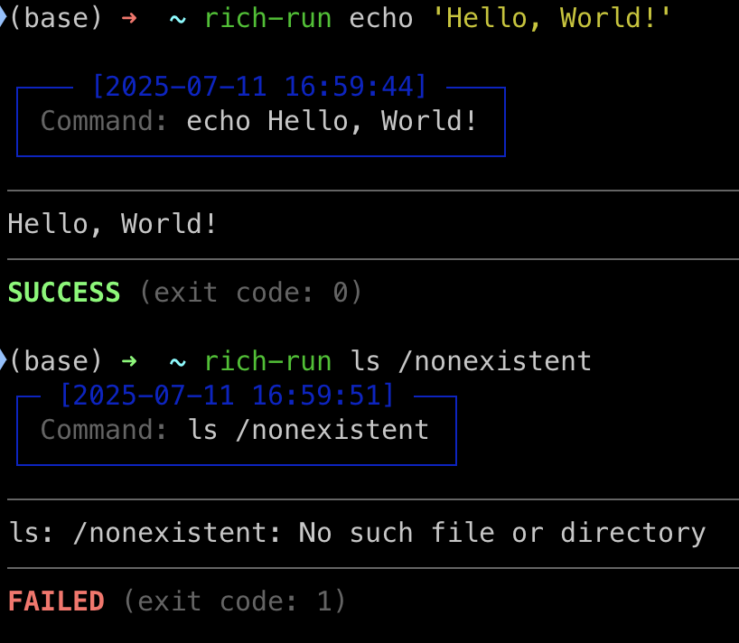

<div align="center">

# Rich Run

[](https://github.com/tanganke/rich-run/blob/main/LICENSE)
[](https://pypi.org/project/rich-run/)
[](https://pepy.tech/project/rich-run)

</div>

A command runner with rich formatting that wraps your commands in elegant panels and provides clear success/failure feedback.



## Features

- 🎨 Command output with rich formatting
- ⏰ Timestamps for command execution
- ✅ Clear success/failure indicators
- 📦 Easy installation via pip/pipx
- 🚀 Drop-in replacement for running commands

## Installation

### Via pipx (recommended)

```bash
pipx install rich-run
```

### Via pip

```bash
pip install rich-run
```

### Prerequisites

This package depends on `rich-cli`. If it's not already installed, you can install it with:

```bash
pipx install rich-cli
```

## Usage

Simply prepend `rich-run` to any command you want to run:

```bash
# Run a simple command
rich-run echo 'Hello, World!'

# Run a more complex command
rich-run python -c "print('This is a Python script')"

# Run commands with arguments
rich-run ls -la /usr/local

# Chain commands (note: use quotes to preserve shell behavior)
rich-run "echo 'First command' && echo 'Second command'"
```

## Example Output

When you run a command with `rich-run`, you'll see:

1. A blue panel showing the command being executed with a timestamp
2. A separator line
3. The actual command output
4. Another separator line
5. A success (green) or failure (red) message with the exit code

## Development

To set up for development:

```bash
git clone https://github.com/tanganke/rich-run.git
cd rich-run
pip install -e .
```

## License

MIT License - see the LICENSE file for details.

## Contributing

Contributions are welcome! Please feel free to submit a Pull Request.
