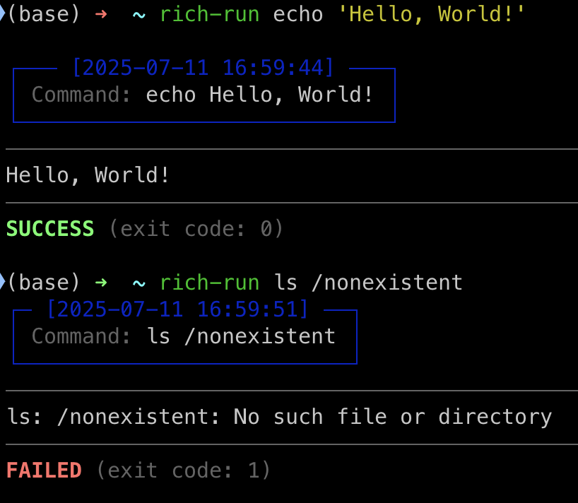

<div align="center">

# 🚀 Rich Run

[](https://github.com/tanganke/rich-run/blob/main/LICENSE)
[](https://pypi.org/project/rich-run/)
[](https://pepy.tech/project/rich-run)
[](https://github.com/tanganke/rich-run)

**用美观信息丰富的输出来改变您的命令行体验**

[English](README.md) | 中文 | [日本語](README.ja.md)

</div>

Rich Run 是一个命令行包装器，通过将命令包装在优雅的彩色面板中，提供时间戳、清晰的成功/失败指示器和美观的格式化来提升您的终端体验。告别朴素无趣的命令输出！

## 📋 目录

- [✨ 特性](#-特性)
- [📦 安装](#-安装)
- [🚀 使用方法](#-使用方法)
- [📸 示例](#-示例)
- [🎯 使用场景](#-使用场景)
- [🛠️ 开发](#️-开发)
- [❓ 常见问题](#-常见问题)
- [🤝 贡献](#-贡献)
- [📄 许可证](#-许可证)
- [🙏 致谢](#-致谢)

<div align="center">

</div>

## ✨ 特性

- 🎨 **美观输出**：命令被包装在优雅的彩色面板中
- ⏰ **时间戳**：精确显示命令开始和结束的时间
- ✅ **状态指示器**：通过退出码清晰地显示成功/失败的视觉反馈
- 🌈 **丰富格式化**：利用强大的 `rich` 库实现令人惊艳的终端输出
- 📦 **简易安装**：通过 pip 或 pipx 安装，零配置
- 🚀 **即插即用替换**：只需在现有命令前添加 `rich-run`
- 🔧 **通用兼容性**：适用于任何命令行工具或脚本
- 📊 **进度可视化**：一目了然地查看命令执行流程

## 📦 安装

### 选项 1：pipx（推荐）

[pipx](https://pipx.pypa.io/) 在隔离环境中安装包，防止依赖冲突：

```bash
# 如果未安装 pipx，可以先使用 `pip install pipx` 安装
pipx install rich-run
```

### 选项 2：pip

```bash
pip install rich-run
```

### 选项 3：从源码安装

```bash
git clone https://github.com/tanganke/rich-run.git
cd rich-run
pip install -e .
```

> [!NOTE]  
> Rich Run 依赖于 `rich-cli`。它会随包自动安装，但如果遇到问题，您可以手动安装：
>
> ```bash
> pipx install rich-cli  # 或 pip install rich-cli
> ```

## 🚀 使用方法

Rich Run 设计为任何命令的即插即用替换。只需在现有命令前添加 `rich-run`：

### 基本语法

```bash
rich-run <您的命令>
```

### 快速示例

```bash
# 简单命令
rich-run echo "Hello, Rich World!"
rich-run ls -la
rich-run pwd

# Python 脚本
rich-run python my_script.py
rich-run python -c "print('Hello from Python!')"

# 系统命令
rich-run wget https://example.com/file.zip

# 复杂命令与管道和重定向（使用引号）
rich-run "ls -la | grep .py | wc -l"
rich-run "echo 'data' > output.txt && cat output.txt"
```

## 📸 示例

### 您将看到的内容

使用 Rich Run 运行命令时，您会得到：

1. **📋 命令面板**：蓝色标题显示确切的命令和开始时间戳
2. **📄 清晰输出**：清晰显示命令的输出
3. **✅ 状态面板**：彩色页脚显示成功/失败状态和执行时间

### 示例输出

**成功命令：**

```bash
rich-run echo "Success!"
```

显示带有退出码 0 的绿色成功面板。

**失败命令：**

```bash
rich-run ls /nonexistent
```

显示带有实际退出码的红色错误面板。

**长时间运行的命令：**

```bash
rich-run sleep 3 && echo "Done!"
```

显示时间戳以跟踪执行时间。

## 🎯 使用场景

Rich Run 非常适合：

- **📊 监控脚本**：跟踪自动化脚本的执行状态
- **🔍 调试**：在复杂工作流中清晰地看到命令成功/失败
- **📚 学习**：更好地理解命令执行和退出码
- **🎨 演示**：使终端演示更具视觉吸引力
- **📝 文档**：生成清晰、格式化的命令示例
- **🔧 CI/CD**：增强构建脚本输出的可读性
- **👥 团队协作**：分享更有信息量的命令输出

## 🛠️ 开发

### 设置开发环境

```bash
# 克隆仓库
git clone https://github.com/tanganke/rich-run.git
cd rich-run

# 创建虚拟环境（可选但推荐）
python -m venv venv
source venv/bin/activate  # Windows 上：venv\Scripts\activate

# 以开发模式安装
pip install -e .

# 安装开发依赖（如果您添加了它们）
pip install -e ".[dev]"  # 如果您在 pyproject.toml 中添加了开发依赖
```

### 项目结构

```
rich-run/
├── rich_run/           # 主包
├── docs/               # 文档资源
├── pyproject.toml      # 项目配置
└── README.md
```

## ❓ 常见问题

<details>
<summary><strong>问：Rich Run 是否适用于所有命令？</strong></summary>

答：是的！Rich Run 适用于任何命令行工具、脚本或二进制文件。它只是包装执行和格式化。
</details>

<details>
<summary><strong>问：我可以在脚本和 CI/CD 中使用 Rich Run 吗？</strong></summary>

答：当然可以！Rich Run 保留退出码，在自动化环境中工作良好。
</details>

<details>
<summary><strong>问：Rich Run 是否会影响命令性能？</strong></summary>

答：开销很小 - 只是格式化和显示面板的时间。
</details>

<details>
<summary><strong>问：我可以自定义输出格式吗？</strong></summary>

答：目前，Rich Run 使用固定格式，但自定义功能可能会在未来版本中添加。
</details>

<details>
<summary><strong>问：如果我的命令需要交互式输入怎么办？</strong></summary>

答：Rich Run 会传递 stdin，所以交互式命令正常工作。
</details>

## 🤝 贡献

我们欢迎贡献！以下是您可以帮助的方式：

### 贡献方式

- 🐛 **错误报告**：发现问题？[提出 issue](https://github.com/tanganke/rich-run/issues)
- 📝 **文档**：帮助改进我们的文档
- 🔧 **代码**：为错误修复或新功能提交拉取请求

### 开发工作流程

1. Fork 仓库
2. 创建功能分支：`git checkout -b feature/amazing-feature`
3. 进行更改
4. 如适用，添加测试
5. 提交更改：`git commit -m 'Add amazing feature'`
6. 推送到分支：`git push origin feature/amazing-feature`
7. 打开拉取请求

## 📄 许可证

此项目采用 MIT 许可证 - 有关详细信息，请参阅 [LICENSE](LICENSE) 文件。

## 🙏 致谢

- **[Rich](https://github.com/Textualize/rich)**：为我们美观的终端输出提供支持的出色库
- **[Rich-CLI](https://github.com/Textualize/rich-cli)**：Rich 的命令行界面
- **社区**：感谢所有帮助改进 Rich Run 的贡献者和用户
